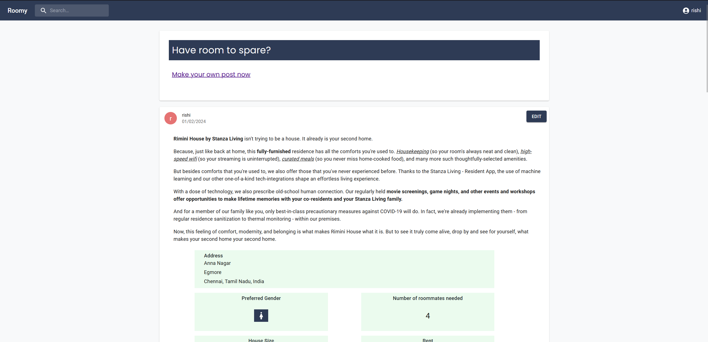
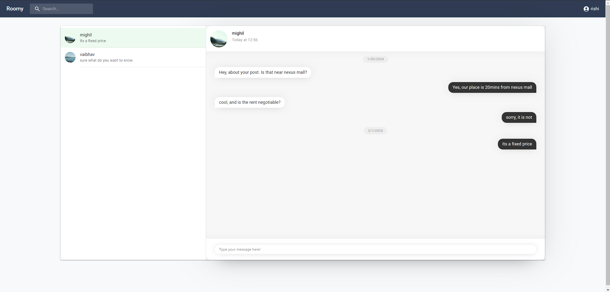

# Roomy

Roomy is a website that is used to help connect people looking for roommates and people looking for rooms. It allows users to create posts regarding their rooms and allows other users to message them regarding their property

It is built using

- react, with redux toolkit in the front end (found in this repo)
- nodejs, express with a mysql db (found [here](https://github.com/Mighil31/roomy-backend))

The chat system is built using socket.io

**This app is a WIP**

Features already implemented:

- Login, logout and protected routes that can only be accessed if logged in
- Create posts
- View all posts in a feed
- Message users using web sockets
- Allow users to see their own posts and edit
- Render markdown in feed

Features to be implemented:

- Make pages responsive (currently mobile devices are not supported)
- Allow users to upload photos
- Add comments to posts
- Search post content

Screenshots:

